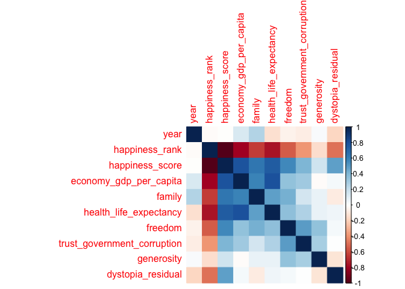

modeling
================

``` r
## clean the data
data <- read_csv("./data/master.csv") %>% 
  janitor::clean_names()
```

    ## Parsed with column specification:
    ## cols(
    ##   country = col_character(),
    ##   year = col_double(),
    ##   sex = col_character(),
    ##   age = col_character(),
    ##   suicides_no = col_double(),
    ##   population = col_double(),
    ##   `suicides/100k pop` = col_double(),
    ##   `country-year` = col_character(),
    ##   `HDI for year` = col_double(),
    ##   `gdp_for_year ($)` = col_number(),
    ##   `gdp_per_capita ($)` = col_double(),
    ##   generation = col_character()
    ## )

``` r
survey <- read_csv("./data/survey.csv") %>% 
  janitor::clean_names()
```

    ## Parsed with column specification:
    ## cols(
    ##   .default = col_character(),
    ##   Timestamp = col_datetime(format = ""),
    ##   Age = col_double()
    ## )

    ## See spec(...) for full column specifications.

``` r
happiness_2015 <- read_csv("./data/2015.csv") %>% 
  janitor::clean_names() %>% 
  mutate(
    year = 2015
  ) %>% 
  select(-region, -standard_error)
```

    ## Parsed with column specification:
    ## cols(
    ##   Country = col_character(),
    ##   Region = col_character(),
    ##   `Happiness Rank` = col_double(),
    ##   `Happiness Score` = col_double(),
    ##   `Standard Error` = col_double(),
    ##   `Economy (GDP per Capita)` = col_double(),
    ##   Family = col_double(),
    ##   `Health (Life Expectancy)` = col_double(),
    ##   Freedom = col_double(),
    ##   `Trust (Government Corruption)` = col_double(),
    ##   Generosity = col_double(),
    ##   `Dystopia Residual` = col_double()
    ## )

``` r
happiness_2016 <- read_csv("./data/2016.csv") %>% 
  janitor::clean_names() %>% 
  mutate(
    year = 2016
  ) %>% 
  select(-region, -lower_confidence_interval, -upper_confidence_interval)
```

    ## Parsed with column specification:
    ## cols(
    ##   Country = col_character(),
    ##   Region = col_character(),
    ##   `Happiness Rank` = col_double(),
    ##   `Happiness Score` = col_double(),
    ##   `Lower Confidence Interval` = col_double(),
    ##   `Upper Confidence Interval` = col_double(),
    ##   `Economy (GDP per Capita)` = col_double(),
    ##   Family = col_double(),
    ##   `Health (Life Expectancy)` = col_double(),
    ##   Freedom = col_double(),
    ##   `Trust (Government Corruption)` = col_double(),
    ##   Generosity = col_double(),
    ##   `Dystopia Residual` = col_double()
    ## )

``` r
happiness_2017 <- read_csv("./data/2017.csv") %>% 
  janitor::clean_names() %>% 
  mutate(
    year = 2017
  ) %>% 
  select(-whisker_high, -whisker_low) 
```

    ## Parsed with column specification:
    ## cols(
    ##   Country = col_character(),
    ##   Happiness.Rank = col_double(),
    ##   Happiness.Score = col_double(),
    ##   Whisker.high = col_double(),
    ##   Whisker.low = col_double(),
    ##   Economy..GDP.per.Capita. = col_double(),
    ##   Family = col_double(),
    ##   Health..Life.Expectancy. = col_double(),
    ##   Freedom = col_double(),
    ##   Generosity = col_double(),
    ##   Trust..Government.Corruption. = col_double(),
    ##   Dystopia.Residual = col_double()
    ## )

``` r
happiness_2015 = happiness_2015[, c(1,11,2,3,4,5,6,7,8,9,10)]
happiness_2016 = happiness_2016[, c(1,11,2,3,4,5,6,7,8,9,10)]
happiness_2017 = happiness_2017[, c(1,11,2,3,4,5,6,7,9,8,10)]
happiness = rbind(happiness_2015, happiness_2016, happiness_2017)
```

``` r
Num.cols <- sapply(happiness, is.numeric)
Cor.data <- cor(happiness[, Num.cols])

corrplot(Cor.data, method = 'color')  
```

<!-- -->
